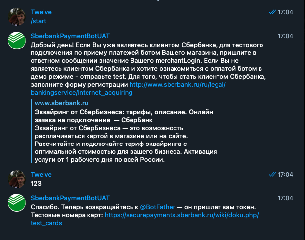

# О проекте

### Технологии, которые мы используем:
- Docker
- Docker-compose
- Python:3.8
- aiogram
- SQLAlchemy
- PostgreSQL

Весь код находится в Докер-контейнерах для простоты деплоя

- Контейнер с PostgreSQL
- Контейнер с PGAdmin
- Контейнер с самим ботом

### Настройка бота:
Для настройки бота, вам нужно изменить `.env` файл:

```sh
# Токен бота
BOT_TOKEN=123123:QWd23f....
# Имя пользователя базы данных
DB_USERNAME=test
# Пароль от базы данных
DB_PASSWORD=test
# Имя базы данных
DB_NAME=testbase

# Путь к директории хранения файлов
DATA_STORAGE=data_storage/
# Путь к файлу с инструкцией бота
INSTRUCTIONS_FILE=./keyboards/instruction.txt

# Токен для оплаты.
PAYMENT_TOKEN=401643678:TEST:....
```

Токен для оплаты можно получить от `BotFather`:

- выбираем бота:

- нажимаем на этого бота

- выбираем `payments`

- если выбрали сбербанк, то бот предложит выбрать тестовый или live способ:

- для примера, я нажму на тестовую оплату

- после чего `botfather` выдаст токен для оплаты, который надо вставить в `.env`

Если вы заполнили все `.env` параметры правильно, то приступаем к установке и запуску!

## Установка
Все что нам нужно - `Docker`. Код написан так, чтобы вся установка прошла автоматически и вам не нужно было заниматься командами (ну или мы попытались так сделать)

Для `Linux`-серверов:
```sh
root@system: sudo apt-get install curl
root@system: sudo apt-get install gnupg
root@system: sudo apt-get install ca-certificates
root@system: sudo apt-get install lsb-release

root@system: sudo mkdir -p /etc/apt/keyrings
root@system: curl -fsSL https://download.docker.com/linux/ubuntu/gpg | sudo gpg --dearmor -o /etc/apt/keyrings/docker.gpg

# Add Docker and docker compose support to the Ubuntu's packages list
root@system: echo "deb [arch=$(dpkg --print-architecture) signed-by=/etc/apt/keyrings/docker.gpg] https://download.docker.com/sudo apt-get install docker-ce docker-ce-cli containerd.io docker-compose-pluginsudo apt-get install docker-ce docker-ce-cli containerd.io docker-compose-pluginlinux/ubuntu   $(lsb_release -cs) stable" | sudo tee /etc/apt/sources.list.d/docker.list > /dev/null

root@system: sudo apt-get update
 
# Install docker and docker compose on Ubuntu
root@system: sudo apt-get install docker-ce docker-ce-cli containerd.io docker-compose-plugin
```

### Windows:
Просто следуйте инструкциям.

### MacOS:
Тыц

## Запуск
```sh
# Находясь в директории src
root@system: docker-compose --env-file .env up
```

Возможно, установка всех образов займет какое-то время...

Если вы получаете похожий результат, то все успешно запущено и можно проверять
Проверить вы можете используя Docker Desktop или cli-версию:


Поздравляю! Бот запущен и работает

---

## Дополнительно
Как вы уже и заметили, Bot, Postgresql, pgAdmin - работают в разных контейнерах и с разными портами.
Так же, имеется возможность просмотра базы данных с использованием pgAdmin - http://127.0.0.1:5050


```yml
General:
    Connection-name: qwerty (вообще, можете использовать любое)
Connection:
    Host name/address: db
    Port: 5432
    Username: тот, который вы указали в .env
    Password: тот, который вы указали в .env
```
Далее жмете `Save` и pgAdmin, думаю, разобраться сможете

## Реализация:

### БД:


```python
# Таблица Users
class Users(BaseModel):
    FirstName = Column(String)
    MiddleName = Column(String)
    LastName = Column(String)
    
    username = Column(String)
    user_id = Column(Integer)
    phone_number = Column(String)
    email = Column(String)

    cookies_file = Column(String, default= None)
    company_id = Column(Integer, default = None)
    recomendations_file = Column(String, default = None)
    list_of_products_file = Column(String, default = None)

    company_name = Column(String)
    revenue = Column(BigInteger)
    added = Column(DateTime, default = datetime.utcnow)
    last_buy = Column(DateTime, default = None)


# Таблица Admins
class Admins(BaseModel):
    id = Column(Integer, primary_key=True)
    username = Column(String, default= None)
    user_id = Column(String)
    created = Column(DateTime, default=datetime.utcnow)
```

## Проект

Все распределено по своим папкам.
Исполняемым файлом служит `start.py`, от которого и идут пляски с импортами и модулями.

В файле `.env` хранится вся информация, которая нужна для запуска базы, бота и так далее

- `core/config.py` - выступает, как загрузчик переменных из `.env`
- `data_storage` - директория для хранения файлов. У каждого пользователя будет свой каталог с данными
- `db/db.py` - запускает `SQLAlchemy`, создает таблицу и сессию
- `keyboards/*` - директория с логикой бота. Тут и клавиатуры, и инструкции, и состояния...
- `models/models.py` - модель таблиц баз данных
- `utils/dataspace.py` - CRUD для базы данных
- `utils/other_utils.py` - создание папки, удаление лишних файлов
- `utils/validator.py` - функции валидации
- `dispatcher.py` - инициализация и создание объектов _dispatcher_ и _bot_
- `docker-compose.py` - инструкция для контейнера, в котором будет все крутиться
- `Dockerfile` - инструкция для запуска бота в контейнере
- `env.example` - планировалось удалить, но да и пусть будет
- `requirements.txt` - зависимости к проекту
- `start.py` - запуск бота, да и всей системы в целом
- `test_database.py` - тестирование базы данных
- `tests.py` - юнит-тесты к `validator`

